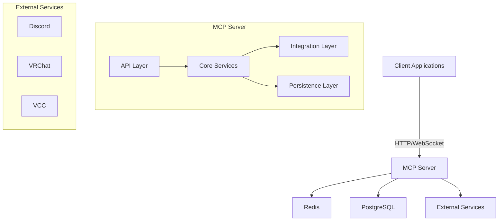

# MKWW MCP Server Architecture

## Overview

The MKWW Master Control Program (MCP) Server is the central orchestration hub for the MKWorldWide ecosystem. It coordinates communication between various services, manages tasks, and ensures system reliability.

## System Architecture

## Core Components

### 1. API Layer
- **REST API**: HTTP endpoints for CRUD operations
- **WebSocket Server**: Real-time bidirectional communication
- **Authentication**: JWT-based authentication and authorization
- **Rate Limiting**: Request throttling and quotas

### 2. Core Services

#### Task Orchestrator
- Manages task lifecycle (create, queue, execute, monitor)
- Implements priority-based task scheduling
- Handles task retries and error recovery

#### Routing Service
- Routes tasks to appropriate handlers
- Manages load balancing between services
- Implements circuit breakers for fault tolerance

#### Memory Service
- Manages conversation history
- Handles message storage and retrieval
- Implements search and context management

#### Resilience Service
- Monitors system health
- Implements circuit breakers
- Handles automatic recovery from failures

### 3. Integration Layer

#### Integration Service
- Manages connections to external services (Discord, VRChat, etc.)
- Handles webhook registration and event processing
- Implements service-specific adapters

#### VCC Service
- Manages VRChat Creator Companion projects
- Handles build and deployment automation
- Monitors project changes

### 4. Persistence Layer

#### Redis
- Caching layer for frequently accessed data
- Pub/Sub for real-time event distribution
- Rate limiting and distributed locks

#### PostgreSQL
- Primary data store for persistent data
- Handles structured data with relationships
- Implements data consistency and transactions

## Data Flow

1. **Client Connection**
   - Client establishes WebSocket connection
   - Authenticates using JWT
   - Subscribes to relevant channels/events

2. **Message Processing**
   - Incoming messages are validated and authenticated
   - Messages are routed to appropriate handlers
   - Tasks are created and queued for processing

3. **Task Execution**
   - Task Orchestrator picks up queued tasks
   - Tasks are executed by appropriate services
   - Results are stored and broadcast to subscribers

4. **Event Propagation**
   - State changes generate events
   - Events are published to Redis Pub/Sub
   - Subscribed clients receive real-time updates

## Security Model

### Authentication
- JWT-based authentication
- Token refresh mechanism
- Role-based access control (RBAC)

### Data Protection
- Encryption in transit (TLS 1.2+)
- Sensitive data encryption at rest
- Secure secret management

### Rate Limiting
- Per-IP and per-user rate limiting
- Request throttling
- Quota management

## Scalability

### Horizontal Scaling
- Stateless services for easy scaling
- Shared-nothing architecture
- Connection pooling

### Load Balancing
- Round-robin request distribution
- Health checks and automatic failover
- Circuit breakers for degraded services

### Caching
- Multi-level caching strategy
- Cache invalidation policies
- Distributed cache synchronization

## Monitoring and Observability

### Logging
- Structured logging with correlation IDs
- Log aggregation and analysis
- Audit trails for security events

### Metrics
- System resource utilization
- Request/response times
- Error rates and types

### Tracing
- Distributed request tracing
- Performance profiling
- Dependency tracking

## Deployment

### Containerization
- Docker-based deployment
- Kubernetes orchestration
- Health checks and liveness probes

### Configuration
- Environment-based configuration
- Feature flags
- Dynamic configuration updates

### CI/CD
- Automated testing
- Blue/green deployments
- Rollback procedures

## Development Workflow

### Local Development
- Docker Compose for local dependencies
- Hot-reload for development
- Mock services for testing

### Testing
- Unit tests with Jest
- Integration tests with TestContainers
- Load testing with Artillery

### Code Quality
- TypeScript type checking
- ESLint for code style
- Pre-commit hooks

## Future Enhancements

### AI/ML Integration
- Natural language processing
- Predictive scaling
- Anomaly detection

### Multi-region Support
- Geo-distributed deployment
- Data replication
- Global load balancing

### Plugin System
- Extensible architecture
- Third-party integrations
- Custom service hooks
